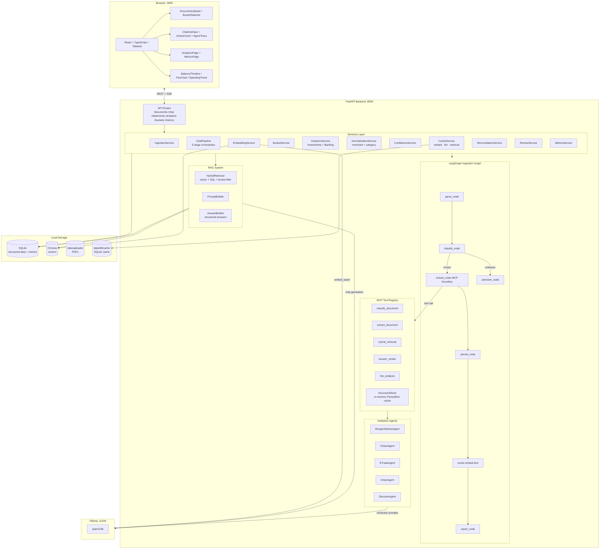
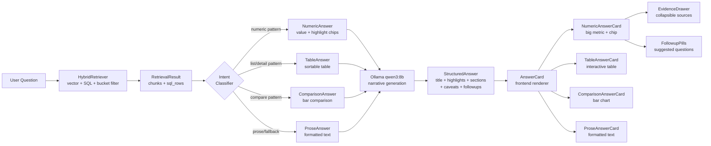
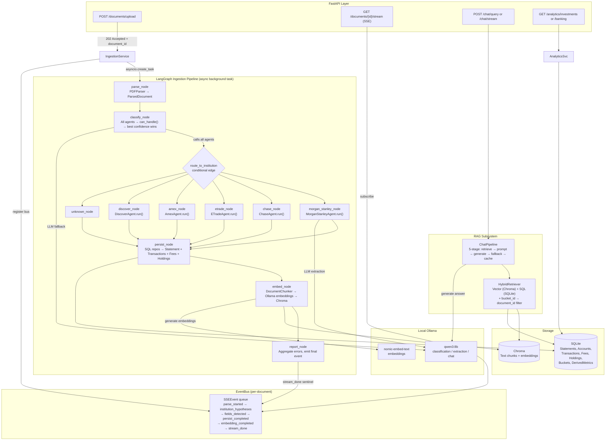

# FinSight AI — Architecture Reference

FinSight AI is a local-first financial intelligence workbench. All processing runs on-device — no cloud LLM APIs, no remote telemetry. The stack is FastAPI + LangGraph + SQLite + Chroma + Ollama on the backend, React + TypeScript + Tailwind on the frontend.

---

## System Overview



---

## Structured Answer Rendering Flow



---

## Adding a New Institution

1. Create `backend/app/agents/institutions/<name>.py` subclassing `BaseInstitutionAgent`. Copy `template.py` as your starting point.
2. Create `backend/app/parsers/<name>/` with `__init__.py`, `classifier.py`, and `extractor.py`.
3. Add a value to `InstitutionType` in `backend/app/domain/enums.py`.
4. Register an instance in `INSTITUTION_AGENT_REGISTRY` in `backend/app/agents/supervisor.py`.
5. Run `tests/test_institution_routing.py` to verify routing, classification, and capability reporting work.

No other files need to change.

---

## Cache Strategy

Three independent caches live in `CacheService`, all backed by a local SQLite database at `data/db/cache`:

| Cache | Key | Purpose |
|---|---|---|
| **Embed cache** | SHA-256 of text chunk | Avoid re-embedding unchanged text across re-ingestions |
| **LLM cache** | SHA-256 of (model + task + prompt) | Avoid duplicate Ollama calls for identical extraction prompts |
| **Retrieval cache** | SHA-256 of (query + bucket_ids) | Short-TTL cache for repeated chat queries within a session |

Caches are content-addressed and evicted by TTL. They never store financial data in a form that bypasses the review pipeline.

---

## Key Design Decisions

| Decision | Rationale |
|---|---|
| SQLite as canonical store | Zero-dependency, file-portable, sufficient for single-user workload; Decimal strings avoid float precision loss |
| Chroma for vectors | In-process, persistent, no separate server; keeps the local-first constraint |
| LangGraph for ingestion pipeline | Explicit node graph makes stage checkpointing and resumability straightforward |
| Staged records before canonical promotion | Every extracted record must pass through review/reconciliation before touching canonical tables — preserves trust |
| MCP tool registry | Decouples agent tool calls from implementation; tools are pluggable without changing graph wiring |
| `InstitutionCapabilities` descriptor | Each agent declares its own extraction surface; supervisor uses this for trace events and future UI capability matrix without runtime introspection |
| `PartialResult[T]` envelope | All analytics endpoints return `{ data, warnings, partial }` — never HTTP 500; degraded answers surface warnings explicitly |
| Bucket-scoped retrieval | `ChatPipeline` resolves `bucket_ids → document_ids` via `bucket_documents` join, then filters Chroma with `document_id.$in` — queries are always scoped to selected context |
| Deterministic normalization first | `category_rules.py` uses ~200 priority-ordered substring rules before any LLM call, making spend categorization fast, predictable, and offline-safe |

---

## Is This Agentic?

**Yes.** FinSight AI uses a **LangGraph supervisor pattern** where a central orchestrator dynamically routes documents to specialized institution agents. Each agent independently decides whether it can handle a document (via `can_handle()`) and performs its own extraction. The system also features a RAG-powered chat pipeline with dynamic query planning.

---

## System Architecture Diagram



---

## Node-by-Node Breakdown

| Node | Responsibility | Emits |
|------|---------------|-------|
| `parse_node` | PDF → text + tables via `pdfplumber` | `parse_started`, `text_extracted` |
| `classify_node` | Run all agents' `can_handle()`, select best by confidence | `institution_hypotheses` |
| `route_to_institution` | Conditional edge → correct institution node | — |
| `morgan_stanley_node` | Full extraction via `MorganStanleyExtractor` + LLM | `extraction_started_v2`, `fields_detected` |
| `chase_node` | Full extraction — checking + all Chase credit card types | `extraction_started_v2`, `fields_detected` |
| `etrade_node` | Full extraction — individual brokerage (holdings, trades, balances, fees) | `extraction_started_v2`, `fields_detected` |
| `amex_node` | Full extraction — Amex credit cards | `extraction_started_v2`, `fields_detected` |
| `discover_node` | Full extraction — Discover credit cards | `extraction_started_v2`, `fields_detected` |
| `persist_node` | Write Statement, Transactions, Fees, Holdings to SQLite | `persist_started`, `persist_completed` |
| `embed_node` | Chunk text → embed via Ollama → store in Chroma | `embedding_started_v2`, `embedding_completed` |
| `report_node` | Aggregate errors, compute status, close pipeline | `ingestion_pipeline_complete` |

---

## Agent Registry Pattern

Agents are dynamically registered — the supervisor never hardcodes institution logic:

```python
INSTITUTION_AGENT_REGISTRY = [
    MorganStanleyAgent(),
    ChaseAgent(),
    ETradeAgent(),
    AmexAgent(),
    DiscoverAgent(),
]
```

Adding a new institution = create a subclass of `BaseInstitutionAgent` + add to the list. No changes to the supervisor or routing logic needed.

---

## Chat RAG Pipeline

```
User question + bucket_ids
  ↓
ChatPipeline._execute()
  ↓
Stage 1 — HybridRetriever (5s timeout)
  ├─ Resolve bucket_ids → document_ids (bucket_documents table)
  ├─ Vector search (Chroma, top-6 chunks, filtered by document_id)
  └─ If aggregation keywords: SQL generation + execution (SQLite)
  ↓
Short-circuit checks:
  ├─ 0 chunks + 0 SQL rows  →  deterministic no-data answer (no LLM)
  └─ 1+ chunks OR SQL rows  →  proceed to LLM
  ↓
Stage 2 — Build prompt (history + retrieved context)
  ↓
Stage 3 — qwen3:8b generation (30s watchdog)
  └─ On timeout/stall  →  Stage 3b: retrieval-only answer (no LLM)
  └─ On complete fail  →  Stage 3c: safe error message
  ↓
Stage 4 — Build StructuredAnswer (prose + sources + confidence + caveats)
  ↓
Stage 5 — Cache write (fire-and-forget)
  ↓
ChatResponse → client
```

---

## Analytics Architecture

Two bucket-typed analytics services under `services/analytics/`:

| Service | Bucket | Endpoints |
|---------|--------|-----------|
| `InvestmentsAnalyticsService` | `INVESTMENTS` | `/analytics/investments`, `/analytics/investments/portfolio` |
| `BankingAnalyticsService` | `BANKING` | `/analytics/banking`, `/analytics/banking/spend`, `/analytics/banking/subscriptions` |

Both services:
- Accept a `bucket_id` query param to scope all queries
- Return `PartialResult[T]` — never raise, surface warnings explicitly
- Use the `derived_monthly_metrics` table for pre-aggregated trend data

Legacy endpoints (`/analytics/fees`, `/analytics/balances`, `/analytics/missing`, `/analytics/institutions`) remain for backwards compatibility.

---

## Normalization Pipeline

Transaction descriptions from PDFs are noisy. The normalization flow:

```
Raw description (e.g. "AMAZON.COM*AB12CD SEATTLE WA")
  ↓
MerchantNormalizer.clean()
  ├─ Strip location suffixes, POS codes, reference numbers
  └─ Produce clean name: "Amazon"
  ↓
CategoryRules.match()
  ├─ ~200 priority-ordered substring rules (offline, instant)
  └─ First match → TransactionCategory
  ↓
LLM fallback (only if no rule matched)
  └─ qwen3:8b classifies into one of 15 categories
  ↓
SubscriptionDetector.is_recurring()
  └─ Heuristic: same normalized merchant + amount ± $1 in 2+ months
```

---

## Database Schema

| Table | Purpose |
|-------|---------|
| `institutions` | Financial institution records |
| `accounts` | Individual accounts per institution |
| `statement_documents` | Raw uploaded PDF documents + processing status |
| `statements` | Parsed + normalized statement metadata |
| `balance_snapshots` | Point-in-time balance per account/statement |
| `transactions` | Individual transactions (banking + investment trades) |
| `fees` | Fee records (advisory, management, etc.) |
| `holdings` | Investment holdings per statement |
| `buckets` | Product-level groupings (INVESTMENTS / BANKING) |
| `bucket_documents` | Many-to-many join: buckets ↔ statement_documents |
| `processing_events` | Durable audit log of SSE pipeline events |
| `derived_monthly_metrics` | Pre-aggregated monthly metrics per account |
| `deletion_records` | Audit trail for document deletions |

---

## What Makes It Agentic

| Property | Present? | Detail |
|----------|----------|--------|
| Supervisor / orchestrator | Yes | LangGraph `StateGraph` routes dynamically |
| Specialized agents | Yes | Per-institution agents with `can_handle()` + `extract()` |
| Shared state | Yes | `IngestionState` TypedDict passed through all nodes |
| Tool use | Yes | MCP tool registry (`classify_document`, `extract_document`, `hybrid_retrieval`, `fee_analysis`) |
| Dynamic routing | Yes | Conditional edges based on classification confidence |
| RAG-augmented reasoning | Yes | Hybrid retrieval (vector + SQL, bucket-scoped) for chat |
| Autonomous loops | Not yet | DAG is acyclic; no retry/self-correction loops (yet) |

---

## Phase Status

| Phase | Feature | Status |
|-------|---------|--------|
| 1 | Morgan Stanley extraction | Done |
| 2 | Chase + E*TRADE agents | Done |
| 2 | Amex + Discover agents | Done |
| 2 | SSE event streaming | Done |
| 2 | Structured answers + AnswerCard | Done |
| 2 | Bucket system | Done |
| 3 | Analytics (investments + banking) | Done |
| 3 | Normalization (merchant + category) | Done |
| 3 | Confidence scoring | Done |
| 3 | Cache service (embed + LLM + retrieval) | Done |
| 3 | Reconciliation + review services | Done |
| 3 | Chat pipeline (5-stage, fallbacks) | Done |
| 3 | Bucket-scoped chat retrieval | Done |
| 3 | Derived monthly metrics | Done |
| 4 | OCR support | Planned |
| 4 | Correction workflows | Planned |
| 4 | Self-correction / retry loops | Planned |
