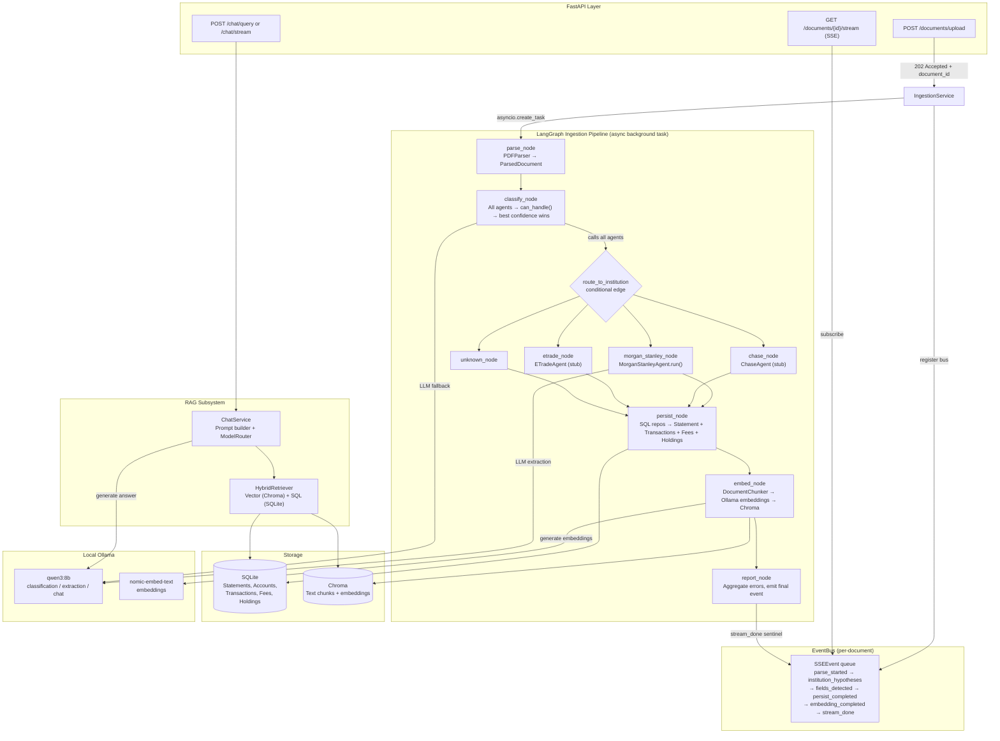

```mermaid
flowchart TD
    subgraph API["FastAPI Layer"]
        UP["POST /documents/upload"]
        SSE["GET /documents/{id}/stream (SSE)"]
        CHAT["POST /chat/query or /chat/stream"]
    end

    subgraph Ingestion["LangGraph Ingestion Pipeline (async background task)"]
        direction TB
        PN["parse_node\nPDFParser → ParsedDocument"]
        CN["classify_node\nAll agents → can_handle() → best confidence wins"]
        RN{"route_to_institution\nconditional edge"}
        MS["morgan_stanley_node\nMorganStanleyAgent.run()"]
        CH["chase_node\nChaseAgent (stub)"]
        ET["etrade_node\nETradeAgent (stub)"]
        UN["unknown_node"]
        PE["persist_node\nSQL repos → Statement + Transactions + Fees + Holdings"]
        EM["embed_node\nDocumentChunker → Ollama embeddings → Chroma"]
        RP["report_node\nAggregate errors, emit final event"]
    end

    subgraph RAG["RAG Subsystem"]
        HR["HybridRetriever\nVector (Chroma) + SQL (SQLite)"]
        CS["ChatService\nPrompt builder + ModelRouter"]
    end

    subgraph Storage["Storage"]
        SQ[("SQLite\nStatements, Accounts,\nTransactions, Fees, Holdings")]
        CR[("Chroma\nText chunks + embeddings")]
    end

    subgraph LLM["Local Ollama"]
        QW["qwen3:8b\nclassification / extraction / chat"]
        NE["nomic-embed-text\nembeddings"]
    end

    subgraph Events["EventBus (per-document)"]
        EB["SSEEvent queue\nparse_started → institution_hypotheses\n→ fields_detected → persist_completed\n→ embedding_completed → stream_done"]
    end

    UP -->|"202 Accepted + document_id"| IngestionService
    IngestionService -->|"asyncio.create_task"| PN
    IngestionService -->|"register bus"| EB
    SSE -->|"subscribe"| EB

    PN --> CN
    CN -->|"calls all agents"| RN
    RN --> MS
    RN --> CH
    RN --> ET
    RN --> UN
    MS --> PE
    CH --> PE
    ET --> PE
    UN --> PE
    PE --> EM
    EM --> RP
    RP -->|"stream_done sentinel"| EB

    PE --> SQ
    EM --> CR
    EM -->|"generate embeddings"| NE
    MS -->|"LLM extraction"| QW
    CN -->|"LLM fallback"| QW

    CHAT --> CS
    CS --> HR
    HR --> CR
    HR --> SQ
    CS -->|"generate answer"| QW
```