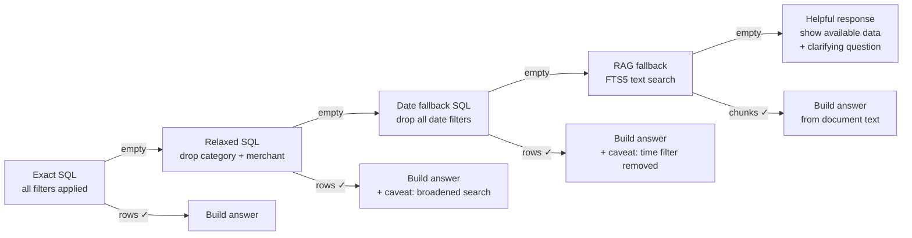

# Coral — Architecture Reference

## Overview

Coral uses a **local-folder-first** data flow:

```
Local folders → Scanner → Parser Registry → SQLite DB → Dashboards + Chat
```

No cloud. No LangGraph. No Chroma. No MCP. SQL is the primary source of truth.

---

## Data flow

### 1. Scan (`GET /api/v1/scan/status`)

The **local scanner** (`services/local_scanner.py`) reads `STATEMENT_SOURCES` from `statement_sources.py` and:
- Globs each `root_path` for `*.pdf` files (recurses into `YYYY/` subdirs)
- Computes SHA-256 for each file
- Checks the `documents` table for existing hashes
- Returns a `ScanResult` with per-source counts: total / ingested / pending / failed / no_parser

No files are written. This is a read-only status check.

### 2. Ingest (`POST /api/v1/scan/ingest`)

For each pending file from the scan:
- Calls `ingest_document(file_path, ...)` in `services/ingestion.py`
- The ingestion pipeline runs sequentially:
  1. Register document in DB (`documents` table)
  2. Parse PDF → raw text + tables via `pdfplumber`
  3. Detect institution via `ParserRegistry.detect_institution()` (confidence scoring)
  4. Extract structured data via `parser.extract()`
  5. Persist canonical records: institution, account, statement, transactions, fees, holdings, balances
  6. Save bank-specific detail fields (chase_details, morgan_stanley_details, etc.)
  7. Chunk text and index in FTS5 (`text_chunks` + `text_chunks_fts`)
  8. Optionally generate embeddings (if vector_search_enabled)

### 3. Dashboard queries

All dashboard data comes from `services/dashboard/`:
- `investment_queries.py` — portfolio value, holdings, fees, balance history
- `banking_queries.py` — spend by month, by category, top merchants, card summary, cash flow
- `summary_queries.py` — top-level KPI counts, document coverage

The `api/dashboard.py` router assembles these into three endpoints:
- `GET /dashboard/investments`
- `GET /dashboard/banking`
- `GET /dashboard/summary`

### 4. Chat

#### Query flow (streaming — `POST /api/v1/chat/stream`)

```mermaid
flowchart TD
    A([User types a question\nin ChatPage]) --> B

    subgraph Frontend ["Frontend — ChatPage.tsx"]
        B[streamChat&#40;&#41; opens\nSSE connection to\nPOST /chat/stream]
        B --> B1["event: status\n'Understanding your question…'"]
        B1 --> B2["event: intent\ndomain · intent · confidence"]
        B2 --> B3["event: tool_start\ntool name · intent"]
        B3 --> B4["event: tool_result\nrow_count · summary"]
        B4 --> B5["event: answer_token\n&#40;one per LLM token&#41;"]
        B5 --> B6["event: table  &#40;if rows exist&#41;\n+ event: chart  &#40;if chart built&#41;"]
        B6 --> B7["event: done\nrequest_id · duration_ms"]
        B7 --> B8[AnswerCard rendered\nwith StructuredAnswer]
    end

    subgraph Backend ["Backend — chat/streaming.py"]
        C[classify intent\nvia Gemma 4 / Ollama\nwith 1 retry + rule fallback]
        C --> D{needs\nclarification?}
        D -- yes --> E[emit clarifying\nquestion as answer_token\n→ done]
        D -- no --> F[resolve route\nSQL / FTS / HYBRID]

        F --> G{SQL path?}
        G -- yes --> H["sql_query.execute_for_intent&#40;&#41;\n11 deterministic handlers\nno LLM-generated SQL"]
        H --> I{rows\nreturned?}
        I -- no rows,\ncategory/merchant set --> J[relax filters:\ndrop category + merchant\nretry SQL]
        J --> I
        I -- no rows,\ndate set --> K[date fallback:\ndrop all date filters\nretry SQL]
        K --> I
        I -- rows found --> L[emit tool_result\nand continue]
        I -- still empty --> M{RAG\nfallback}

        G -- no SQL --> M
        M -- FTS path --> N[text_search.search&#40;&#41;\nSQLite FTS5 full-text]
        M -- VECTOR path --> O[vector_search.search&#40;&#41;\ncosine similarity\non stored embeddings]
        N --> P[combine chunks]
        O --> P

        L --> Q{data\nexists?}
        P --> Q
        Q -- no data at all --> R[helpful fallback:\nlist available categories\ndate range · institutions\n+ clarifying question]
        R --> S[emit answer_token\n→ done]

        Q -- data found --> T[build table payload\nif sql rows exist]
        T --> U[build chart payload\nvia chart_builder.py]
        U --> V["generate_stream&#40;&#41;\nOllama token-by-token\nSystem: use only provided data\nnever invent numbers"]
        V --> W[emit answer_token\nper token]
        W --> X[emit done]
    end

    B --> C
    C -.->|SSE events| B1
    L -.->|SSE events| B3
    V -.->|SSE tokens| B5
    X -.->|SSE done| B7
```



#### Fallback chain (ensures no blank answers)



#### Intent → SQL handler mapping

| ChatIntent | Internal QueryIntent | Route | SQL handler |
|---|---|---|---|
| `spending_summary` | `SPENDING_BY_CATEGORY` | SQL | Groups spend by category/institution |
| `transaction_search` | `TRANSACTION_LOOKUP` | SQL | Filters by merchant/category/date/account |
| `income_summary` | `CASH_FLOW_SUMMARY` | SQL | Sums inflow vs outflow by account |
| `balance_summary` | `BALANCE_LOOKUP` | SQL | Latest balance snapshot per account |
| `investment_summary` | `HOLDINGS_TOTAL` | HYBRID | Market value from most-recent statement |
| `fees_summary` | `FEE_SUMMARY` | HYBRID | Fee records by category/institution |
| `document_lookup` | `TEXT_EXPLANATION` | FTS | FTS5 full-text search on text_chunks |
| `account_summary` | `BALANCE_LOOKUP` | SQL | Account list with balances |
| `comparison` | `SPENDING_BY_CATEGORY` | SQL | Side-by-side by institution/period |
| `unknown` | `HYBRID_FINANCIAL_QUESTION` | HYBRID | Broad SQL + FTS fallback |

#### Non-negotiable rules enforced at every stage

- **Gemma 4 never writes SQL.** All SQL is pre-written Python in `sql_query.py`.
- **Gemma 4 never invents numbers.** The system prompt contains: *"Do not speculate beyond the provided data. Never invent numbers."*
- **No bare "no data" response.** The fallback chain always surfaces what data exists and asks a clarifying question.
- **All LLM calls are local** (Ollama on `localhost:11434`). No financial data leaves the machine.
- **Account numbers are masked** in answers and logs (`guardrails.py`).

---

## Key modules

### Backend (`backend/app/`)

| Module | Purpose |
|--------|---------|
| `statement_sources.py` | Maps local folders → institution/product |
| `services/local_scanner.py` | Discovers PDFs, computes hashes, checks ingest status |
| `services/ingestion.py` | Full ingestion pipeline for one document |
| `parsers/base.py` | `InstitutionParser` ABC + `ParserRegistry` |
| `parsers/<name>/parser.py` | Institution-specific extraction logic |
| `db/models.py` | SQLModel ORM — canonical + detail tables |
| `db/repositories.py` | All DB access (no raw SQL in services) |
| `services/dashboard/investment_queries.py` | Investment dashboard queries |
| `services/dashboard/banking_queries.py` | Banking dashboard queries |
| `services/dashboard/summary_queries.py` | KPI summary queries |
| `api/dashboard.py` | Dashboard API endpoints |
| `api/scan.py` | Scan status + ingest trigger endpoints |
| `services/intent_classifier.py` | Gemma 4 intent classification + rule fallback |
| `services/chat_router.py` | Main chat pipeline — classify → SQL → RAG → answer |
| `services/sql_query.py` | 11 deterministic SQL handlers, no LLM SQL |
| `services/answer_builder.py` | Structures answers, calls LLM for formatting |
| `services/normalization.py` | Institution / category / account / date alias resolution |
| `chat/streaming.py` | SSE streaming pipeline — emits status/token/table/chart events |
| `chat/guardrails.py` | Destructive action detection, account number masking |
| `chat/evals/run_chat_evals.py` | Golden question eval runner |

### Frontend (`frontend/src/`)

| Module | Purpose |
|--------|---------|
| `pages/HomePage.tsx` | Dashboard home — KPIs, source cards, bucket dashboards |
| `pages/ChatPage.tsx` | Chat interface |
| `api/scan.ts` | Scan status + ingest API calls |
| `api/dashboard.ts` | Dashboard API calls + TypeScript types |
| `components/chat/AnswerCard.tsx` | Structured answer renderer (numeric, table, prose, no_data) |

---

## Parser system

Each parser implements `InstitutionParser` (abstract base in `parsers/base.py`):

```python
class InstitutionParser(ABC):
    institution_type: str         # e.g. "chase"
    institution_name: str         # e.g. "Chase"

    def can_handle(text, metadata) -> float:
        # Returns confidence 0.0–1.0. > 0.7 = strong match.
        # Uses regex/keyword matching on first ~3000 chars. No LLM.

    async def extract(document: ParsedDocument) -> ParsedStatement:
        # Returns canonical ParsedStatement with transactions, fees, holdings, balances.
```

`ParserRegistry.detect_institution()` runs all parsers' `can_handle()` and returns the best match.

---

## Scanner deduplication

Files are deduplicated by SHA-256 hash stored in `documents.file_hash`:

```
New scan → compute hash → check documents table by hash
  → hash found + status=parsed  → INGESTED (skip)
  → hash found + status=failed  → FAILED (retry)
  → hash not found              → PENDING (ingest)
```

This means:
- Moving a file to a different folder and re-scanning does not re-ingest it
- Modifying a file creates a new hash and triggers re-ingestion
- Deleting a document from the DB and re-scanning re-ingests it

---

## Source configuration

`statement_sources.py` contains `STATEMENT_SOURCES: list[StatementSource]`.

Each `StatementSource` has:
- `source_id` — stable key (e.g. "chase_freedom")
- `institution_type` — routes to the correct parser
- `account_product` — human-readable label shown in UI
- `bucket` — "investments" or "banking"
- `root_path` — absolute path to scan
- `glob_pattern` — default `"**/*.pdf"` (recurses into YYYY/)
- `filename_hints` — optional filters when multiple products share a folder

`PARSEABLE_INSTITUTION_TYPES` lists which institution_types have working parsers. Sources with other types are scanned and counted but not ingested.

---

## Query router (chat intents)

| Intent | SQL path | Example question |
|--------|----------|-----------------|
| `fee_summary` | SQL | "How much did I pay in fees?" |
| `balance_lookup` | SQL | "What's my account balance?" |
| `holdings_lookup` | SQL | "What stocks do I hold?" |
| `transaction_lookup` | SQL | "Show me transactions over $500" |
| `cash_flow_summary` | SQL | "What's my monthly spend?" |
| `document_availability` | SQL | "What documents have I uploaded?" |
| `institution_coverage` | SQL | "Which banks are connected?" |
| `statement_coverage` | SQL | "How far back do my statements go?" |
| `text_explanation` | FTS | "What does Morgan Stanley say about my advisory fees?" |
| `hybrid_financial_question` | SQL + FTS | General fallback |
