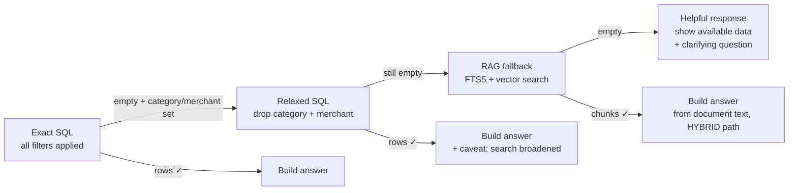

# Coral — Architecture Reference

## Overview

Coral uses a **local-folder-first** data flow:

```
Local folders → Scanner → Parser Registry → SQLite DB → Dashboards + Chat
```

No cloud. SQL is the primary source of truth. `langgraph` and `chromadb` are
still listed as dependencies in `backend/pyproject.toml` and a stray
`backend/data/chroma/` directory exists on disk, but neither is wired into any
route — the chat pipeline is 100% SQL + SQLite FTS5 + in-SQLite cosine-similarity
vector search (`services/vector_search.py`, embeddings stored as JSON in
`text_chunks.embedding`). `_log_startup_diagnostics()` in `main.py` logs
`langgraph_installed` / `langgraph_wired_to_chat: False` on every boot as a
reminder that it's dead weight.

---

## Data flow

### 1. Scan (`GET /api/v1/scan/status`)

The **local scanner** (`services/local_scanner.py`) reads `STATEMENT_SOURCES` from
`app/statement_sources.py` and:
- Globs each `root_path` for `*.pdf` files (recurses into `YYYY/` subdirs)
- Computes SHA-256 for each file
- Checks the `documents` table for existing hashes
- Returns a `ScanResult` with per-source counts: total / ingested / pending / failed / no_parser

No files are written. This is a read-only status check.

### 2. Upload (`POST /api/v1/documents/upload-local`)

The structured upload path used by the `frontend-next` Upload page. The
frontend picks institution/account/year/month from `app/config/statement_catalog.py`
(via `GET /api/v1/catalog/institutions`), and the backend writes the file to the
normalized path `$CORAL_STATEMENTS_ROOT/<rel_path>/<year>/<account_slug>_<year>_<MM>_<month>.pdf`
before handing it to the same ingestion pipeline as the scanner.

### 3. Ingest (`POST /api/v1/scan/ingest`, or triggered from upload)

For each pending file:
- Calls `ingest_document(file_path, ...)` in `services/ingestion.py`
- The ingestion pipeline runs sequentially:
  1. Register document in DB (`documents` table)
  2. Parse PDF → raw text + tables via `pdfplumber`
  3. Detect institution via `ParserRegistry.detect_institution()` (confidence scoring)
  4. Extract structured data via `parser.extract()`
  5. Persist canonical records: institution, account, statement, transactions, fees, holdings, balances
  6. Save bank-specific detail fields (`chase_details`, `morgan_stanley_details`, etc. — Bank of America has no detail table, only canonical rows)
  7. Chunk text and index in FTS5 (`text_chunks` + `text_chunks_fts`)
  8. Optionally generate embeddings into `text_chunks.embedding` (if `search.vector_search_enabled`)

### 4. Dashboard queries

All dashboard data comes from `services/dashboard/`:
- `investment_queries.py` — portfolio value, holdings, fees, balance history
- `banking_queries.py` — spend by month, by category, top merchants, card summary, cash flow
- `summary_queries.py` — top-level KPI counts, document coverage

The `api/dashboard.py` router assembles these into endpoints:
- `GET /dashboard/investments`
- `GET /dashboard/banking`
- `GET /dashboard/summary`
- `GET /dashboard/coverage`

### 5. Chat

Coral's chat has **two intent systems** — know which one you're looking at:

- **`ChatIntent` / `RouteType`** (`domain/classification.py`) — the primary,
  user-facing system. `services/intent_classifier.py` classifies the raw
  question into one of these using the LLM (with a rule-based fallback), and
  `services/chat_router.py::route()` is the actual production entry point
  (`api/chat.py` calls it directly, and `chat/streaming.py` wraps it for SSE).
- **`QueryIntent` / `QueryPath`** (`domain/enums.py`) — the internal system the
  13 deterministic SQL handlers in `services/sql_query.py` actually key off of.
  `services/intent_mapping.py::CHAT_TO_QUERY_INTENT` maps every `ChatIntent` to
  a `QueryIntent`. A **separate, older** regex-based classifier still lives at
  `services/query_router.py` (kept for backward compatibility per
  `backend/app/chat/CHATBOT_PRINCIPLES.md`) but is not the code path `api/chat.py` uses.

#### Query flow (`services/chat_router.py::route()`, streamed via `chat/streaming.py` → `POST /api/v1/chat/stream`)


```mermaid
flowchart TD
    A([User types a question]) --> B[classify&#40;&#41;\nLLM intent classifier\n+ rule fallback]
    B --> C{conversation_id\nset?}
    C -- yes --> C1[conversation_context\nresolve follow-up\n&#40;10 turns / 30-min TTL&#41;]
    C -- no --> D
    C1 --> D[build_route_decision&#40;&#41;\ncomplexity gate →\nRouteDecision]
    D --> E[to_query_intent&#40;&#41;\nChatIntent → QueryIntent]
    E --> F[build_query_plan&#40;&#41;\nchat/query_planner.py\ntyped QueryPlan]
    F --> G[determine_answer_style&#40;&#41;\nchat/answer_style.py\nAnswerMode + ResponseShape]
    G --> H{planner needs\nclarification &&\nintent == UNKNOWN?}
    H -- yes --> H1[clarification answer\n→ done]
    H -- no --> I{route_type ==\nAFFORDABILITY?}
    I -- yes --> I1["chat/domains/affordability::analyze&#40;&#41;\n7-layer pipeline\n&#40;bypasses SQL entirely&#41;"]
    I1 --> Z1[done]
    I -- no --> J{classifier still\nneeds clarification?}
    J -- yes --> H1
    J -- no --> K[resolve_path&#40;&#41;\nSQL / FTS / HYBRID]
    K --> L{SQL or\nHYBRID path?}
    L -- yes --> M["sql_query.execute_for_intent&#40;&#41;\n13 deterministic handlers\nno LLM-generated SQL"]
    M --> N{rows\nreturned?}
    N -- no,\ncategory/merchant set --> O[relaxed retry:\ndrop category + merchant\n_relaxed = True]
    O --> N
    L -- no --> P
    N --> P{need RAG?\nFTS/VECTOR/HYBRID path,\nor SQL came back empty}
    P -- yes --> Q[text_search.search&#40;&#41; FTS5\n&#43; vector_search.search&#40;&#41;\ncosine similarity]
    P -- no --> R
    Q --> R{rows or chunks\nor suggestions?}
    R -- yes --> S[answer_builder.build_answer&#40;&#41;\napplies answer_style\nadds relaxation caveat if any]
    S --> Z2[record_turn&#40;&#41; if\nconversation_id set\n→ done]
    R -- no --> T[helpful fallback:\navailable categories/institutions\n+ date range + clarifying question]
    T --> Z3[done]
```

#### Fallback chain (ensures no blank answers)


```mermaid
flowchart LR
    S1[Exact SQL\nall filters applied] -->|empty + category/merchant set| S2
    S2[Relaxed SQL\ndrop category + merchant] -->|still empty| S3
    S3[RAG fallback\nFTS5 + vector search] -->|empty| S4
    S4[Helpful response\nshow available data\n+ clarifying question]

    S1 -->|rows ✓| A1[Build answer]
    S2 -->|rows ✓| A2[Build answer\n+ caveat: search broadened]
    S3 -->|chunks ✓| A3[Build answer\nfrom document text, HYBRID path]
```

#### Affordability fast path (`chat/domains/affordability/`)

`RouteType.AFFORDABILITY` questions ("can I afford a $40k car?") skip SQL
entirely and run a dedicated 7-layer deterministic-math pipeline orchestrated
by `analyzer.py::analyze()`:


```mermaid
flowchart LR
    Q[Question +\nQueryPlan.affordability] --> SP[scenario_parser.py\nderministic regex/heuristic\ntyping: home/car/luxury/\ntravel/private_school/general]
    SP -.optional.-> SSP["semantic_scenario_parser.py\nLLM extracts MEANING only\n&#40;goals, constraints, horizon&#41;\n— never does math"]
    SP --> DC[data_collector.py\nbuilds FinancialSnapshot from\nbalance_snapshots + transactions\nNone &#40;not 0&#41; for missing data]
    SSP --> DC
    DC --> ME[math_engine.py\nDecimal-only arithmetic:\nDTI, reserve impact,\naffordability ratio,\npost-purchase liquidity]
    ME --> DE[decision_engine.py\ndeterministic verdict:\nCOMFORTABLE / REASONABLE /\nSTRETCH / NOT_AFFORDABLE /\nNEEDS_MORE_INFO]
    DE --> AC[advisory_context.py\nsynthesizes math + verdict\ninto advice framing]
    AC --> NB[narrative_builder.py\nfinal NL answer — direct\nanswer first, 2-4 numbers max]
    NB --> V[verifier.py\nchecks LLM narrative didn't\nchange verdict or invent numbers]
    V --> OUT[StructuredAnswer]
```

The LLM only ever narrates a verdict that Python already computed —
`math_engine.py` and `decision_engine.py` are pure Decimal arithmetic with no
LLM involvement, and `verifier.py` is a deterministic safety net that rejects
any narrative that silently changes the numbers or verdict.

#### Intent → route mapping

| `ChatIntent` | → `QueryIntent` (`intent_mapping.py`) | Route | Notes |
|---|---|---|---|
| `spending_summary` | `SPENDING_BY_CATEGORY` | SQL | Groups spend by category/institution |
| `transaction_search` | `TRANSACTION_LOOKUP` | SQL | Filters by merchant/category/date/account |
| `income_summary` | `CASH_FLOW_SUMMARY` | SQL | Sums inflow vs outflow by account |
| `balance_summary` | `BALANCE_LOOKUP` | SQL | Latest balance snapshot per account |
| `investment_summary` | `HOLDINGS_TOTAL` | SQL/HYBRID | Market value from most-recent statement |
| `fees_summary` | `FEE_SUMMARY` | SQL/HYBRID | Fee records by category/institution |
| `document_lookup` | `TEXT_EXPLANATION` | FTS | FTS5 full-text search on `text_chunks` |
| `account_summary` | `BALANCE_LOOKUP` | SQL | Account list with balances |
| `comparison` | `SPENDING_COMPARISON` | SQL | Side-by-side by institution/period |
| `recurring_transactions` | `RECURRING_TRANSACTIONS` | SQL | Rows flagged `is_recurring = 1` |
| `affordability` | `BALANCE_LOOKUP` (unused — bypassed) | **AFFORDABILITY** | Routed straight to `chat/domains/affordability` |
| `unknown` | `HYBRID_FINANCIAL_QUESTION` | HYBRID | Broad SQL + FTS fallback |

The actual path taken at runtime is decided by `RouteType` (`SIMPLE_SQL`,
`SQL_ANALYSIS`, `DOCUMENT_SEARCH`, `HYBRID`, `AFFORDABILITY`, `CLARIFICATION`,
`UNSUPPORTED`), computed by `intent_mapping.py::build_route_decision()` from
the classifier's confidence plus complexity signals in the question.

#### Non-negotiable rules enforced at every stage

- **The LLM never writes SQL.** All SQL is pre-written Python in `sql_query.py` (13 handlers).
- **The LLM never invents numbers.** Affordability math is pure Decimal arithmetic in `math_engine.py`; `answer_verifier.py` and `chat/domains/affordability/verifier.py` are deterministic safety nets that catch narratives that drift from the computed facts.
- **No bare "no data" response.** The fallback chain always surfaces what data exists and asks a clarifying question.
- **All LLM calls are local** (Ollama on `localhost:11434`, `chat_model = gemma4:latest` for chat/analysis, `classification_model = qwen3:8b` for classification/extraction). No financial data leaves the machine.
- **Account numbers are masked** in answers and logs (`chat/guardrails.py`), which also rejects destructive-action requests.

---

## Key modules

### Backend (`backend/app/`)

| Module | Purpose |
|--------|---------|
| `statement_sources.py` | Maps local folders → institution/product for the **scanner** |
| `config/statement_catalog.py` | Single source of truth for institutions/accounts/buckets/folder layout used by the **structured upload** flow (18 accounts) |
| `services/local_scanner.py` | Discovers PDFs, computes hashes, checks ingest status |
| `services/ingestion.py` | Full ingestion pipeline for one document |
| `parsers/base.py` | `InstitutionParser` ABC + `ParserRegistry` |
| `parsers/<name>/parser.py` | Institution-specific extraction logic (`morgan_stanley`, `chase`, `etrade`, `amex`, `discover`, `bank_of_america`) |
| `db/models.py` | SQLModel ORM — canonical + detail tables |
| `db/engine.py` | Engine + idempotent column migrations (`_apply_migrations()`) |
| `db/fts.py` | FTS5 virtual table setup + `index_chunk()` / `search_fts()` |
| `services/dashboard/{investment,banking,summary}_queries.py` | Dashboard SQL |
| `api/dashboard.py` | Dashboard API endpoints |
| `api/scan.py` | Scan status + ingest trigger endpoints |
| `api/catalog.py` | Serves the statement catalog to the frontend for upload dropdowns |
| `services/intent_classifier.py` | LLM `ChatIntent` classification + rule fallback |
| `services/chat_router.py` | **Primary chat pipeline** — classify → route decision → plan → (affordability \| SQL → RAG fallback) → answer |
| `services/query_router.py` | Legacy regex-based `QueryIntent` classifier — kept for backward compat, not the live path |
| `services/sql_query.py` | 13 deterministic SQL handlers, no LLM SQL |
| `services/intent_mapping.py` | `ChatIntent → QueryIntent` mapping + `build_route_decision()` complexity gate |
| `services/answer_builder.py` | Structures answers, calls LLM for narrative formatting |
| `services/normalization.py` | Institution / category / account / date alias resolution |
| `chat/streaming.py` | SSE wrapper around `chat_router.route()` — emits status/intent/tool/token/table/chart/done events |
| `chat/query_planner.py` | Builds a typed `QueryPlan` between classification and SQL execution |
| `chat/answer_style.py` | Decides `AnswerMode` / `ResponseShape` — how to answer, independent of what data was found |
| `chat/answer_verifier.py` | Deterministic check that the LLM narrative matches the underlying `FactBundle` |
| `chat/fact_builder.py` | Deterministic Python math from SQL rows → `FactBundle` (LLM never calculates) |
| `chat/insight_builder.py` | `FactBundle` → `InsightBundle` (interpreted meaning, still no LLM math) |
| `chat/retrieval.py` | Hybrid retrieval: `fts_only` / `vector_only` / `hybrid` (merged + re-ranked) |
| `chat/semantic_scenario_parser.py` | LLM scenario extractor for complex affordability questions (meaning only, no math) |
| `chat/guardrails.py` | Destructive-action rejection, account-number masking |
| `chat/services/conversation_context.py` | In-memory follow-up resolution (10 turns/conversation, 30-min TTL) |
| `chat/domains/affordability/` | 7-layer affordability pipeline (see diagram above) |
| `chat/evals/run_chat_evals.py` | Golden-question eval runner (`golden_questions.yaml`) |

### Frontend (`frontend-next/`)

| Module | Purpose |
|--------|---------|
| `app/page.tsx` | Home — command center with metrics and quick actions |
| `app/banking/page.tsx` | Banking dashboard |
| `app/investments/page.tsx` | Investments dashboard |
| `app/documents/page.tsx` | Documents library, bucketed by institution/year |
| `app/chat/page.tsx` | Chat interface |
| `app/upload/page.tsx` | Single + bulk document upload |
| `lib/api-client.ts` | Backend API client |
| `store/appStore.ts` | Single Zustand store — chat history, theme |
| `components/chat/` | Chat UI, including the SSE-streamed answer renderer |
| `components/{banking,investments,documents,upload,home}/` | Per-page components |

The old Vite/React `frontend/` directory was fully removed — `frontend-next` (Next.js 14 App Router, port 3001) is the only frontend.

---

## Parser system

Each parser implements `InstitutionParser` (abstract base in `parsers/base.py`):

```python
class InstitutionParser(ABC):
    institution_type: str         # e.g. "chase"
    institution_name: str         # e.g. "Chase"

    def can_handle(text, metadata) -> float:
        # Returns confidence 0.0–1.0. > 0.7 = strong match.
        # Uses regex/keyword matching on first ~3000 chars. No LLM.

    async def extract(document: ParsedDocument) -> ParsedStatement:
        # Returns canonical ParsedStatement with transactions, fees, holdings, balances.
```

`ParserRegistry.detect_institution()` runs all parsers' `can_handle()` and
returns the best match. `parsers/base.py::_register_all_parsers()` registers
six full parsers: Morgan Stanley, Chase, E\*TRADE, Amex, Discover, Bank of
America. Marcus and 529 are catalog-only stubs (`parseable=False` in
`statement_catalog.py`) with no parser registered — files are scanned/counted
but not ingested.

---

## Scanner deduplication

Files are deduplicated by SHA-256 hash stored in `documents.file_hash`:

```
New scan → compute hash → check documents table by hash
  → hash found + status=parsed  → INGESTED (skip)
  → hash found + status=failed  → FAILED (retry)
  → hash not found              → PENDING (ingest)
```

This means:
- Moving a file to a different folder and re-scanning does not re-ingest it
- Modifying a file creates a new hash and triggers re-ingestion
- Deleting a document from the DB and re-scanning re-ingests it

---

## Source configuration — two parallel systems

Coral has **two** separate registries describing institutions, for two
different jobs — don't conflate them:

| | `app/statement_sources.py` | `app/config/statement_catalog.py` |
|---|---|---|
| Used by | The folder **scanner** (`local_scanner.py`) | The structured **upload** flow (`api/catalog.py`, upload-local endpoint) |
| Shape | `STATEMENT_SOURCES: list[StatementSource]` | `ACCOUNT_CATALOG: list[AccountCatalogEntry]` (18 accounts) |
| Key fields | `source_id`, `institution_type`, `account_product`, `bucket`, `root_path`, `glob_pattern`, `filename_hints` | `institution_slug`, `account_slug`, `bucket`, `parser_type`, `parseable`, `rel_path`, `supported_years` |
| Parseable set | `PARSEABLE_INSTITUTION_TYPES` frozenset | per-entry `parseable: bool` |

Bucket rule (same in both): **banking** = Bank of America, Chase checking,
Marcus (all sub-accounts); **investments** = everything else (Amex, Chase
credit cards, Discover, E\*TRADE, Morgan Stanley, 529).

---

## Adding a new institution

1. Create `backend/app/parsers/<name>/parser.py` implementing `InstitutionParser`
2. Register it in `backend/app/parsers/base.py` → `_register_all_parsers()`
3. Add a `StatementSource` in `backend/app/statement_sources.py` and add the `institution_type` to `PARSEABLE_INSTITUTION_TYPES`
4. Add an `AccountCatalogEntry` in `backend/app/config/statement_catalog.py` (for the structured upload flow)
5. Add a bank-specific detail model in `backend/app/db/models.py` if the institution has fields worth capturing beyond the canonical tables
