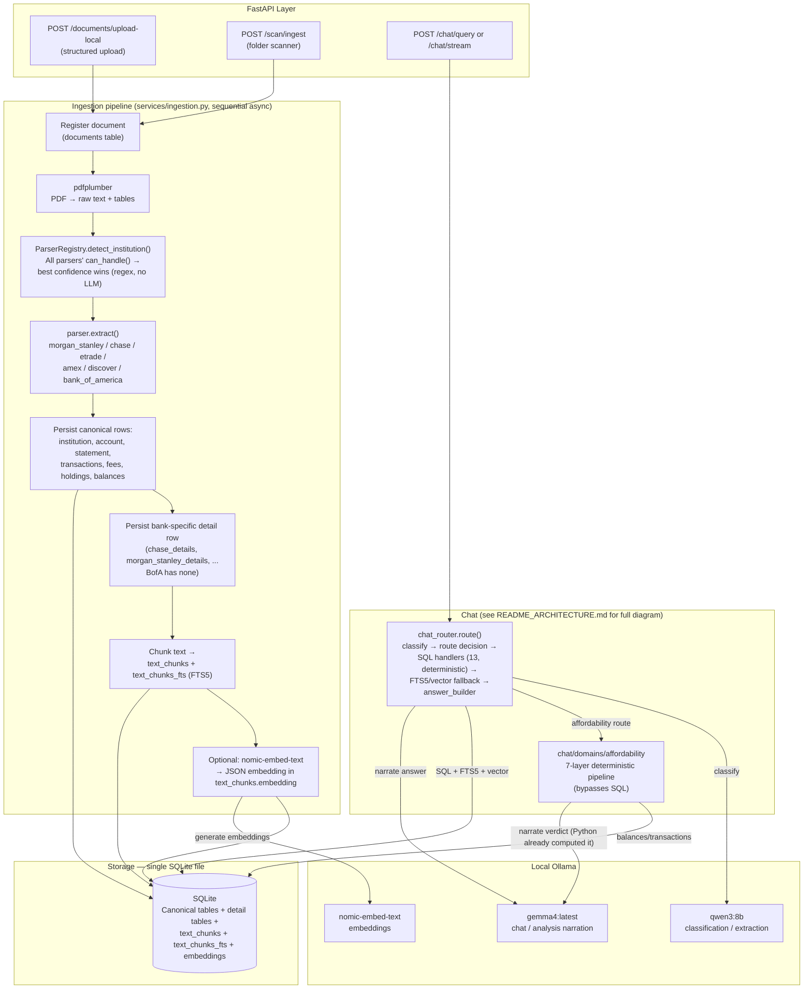

No LangGraph, no Chroma — both remain unused dependencies (see `README_ARCHITECTURE.md`'s Overview section). Ingestion is a plain sequential async pipeline, not a graph; chat routing is plain Python control flow, not an agent framework. See [README_ARCHITECTURE.md](README_ARCHITECTURE.md) for the detailed chat routing, fallback-chain, and affordability-pipeline diagrams.
